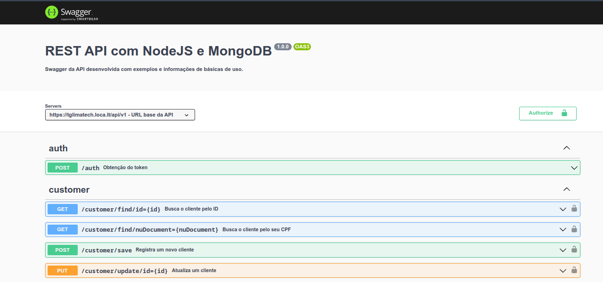

# Rest API com Node.js, Mongo e Docker

## Objetivo

O objetivo deste projeto é disponibilizar uma API REST integrada com um banco não relacional e que seus endpoints possam ser acessados através de um swagger.

---

## Requisitos

Neste projeto foram utilizadas as seguintes tecnologias:

|Tecnologia       |Versão|Obrigatório|
|:---------------:|:----:|:---------:|
|Node.js          |16    |Sim        |
|MongoDb          |6     |Sim        |
|Docker           |23    |Não        |
|Docker-Compose   |2.16  |Não        |

Para a execução simples do projeto não é obrigatório o uso do Docker e do Docker-Compose, ambos são utilizados para facilitar a criação dos ambientes e disponibilidade de serviços como o MongoDB, por exemplo. Nada impede de você instalar o MongoDB na sua máquina de forma tradicional ou utilizar o serviço do [MongoDB da Atlas](https://www.mongodb.com/cloud/atlas/register).

Para maiores informações leias as instruções abaixo:

---

## Instruções

* [Por onde começar?](./docs/tutorials/01-where-to-start.md)
* [Configurando o MongoDB](./docs/tutorials/02-config-mongodb.md)
* [Rodando a aplicação no VSCODE](./docs/tutorials/03-running-app-vscode.md)
* [Rodando a aplicação em um container](./docs/tutorials/04-running-app-container.md)

---

## Versões

As últimas versões desta aplicação estão todos disponíveis neste [link](https://github.com/tglima/restapi-express-mongodb/releases).

## Autores e contribuidores

* Thiago Lima de Sousa - Desenvolvedor principal.

---

## Licença

Esse projeto está sob a licença [MIT License](LICENSE)

