# Configurando o MongoDB

## Objetivo
Como já foi dito na [página inicial](../../README.md), este projeto utiliza o banco de dados não relacional MongoDB. Sendo assim precisamos configurar uma instância do MongoDB, está página serve como um guia básico de como restaurar os backups e criar o usuário específico da aplicação.

Basicamente existem três de formas de configurar o MongoDB para o nosso projeto.

 1) [Usando scripts e criando container](#usando-scripts-e-criando-o-container)
 2) [Instalando o MongoDB na sua máquina](#instalando-o-mongodb-na-sua-máquina)
 3) [Utilizando o MongoDB direto da Web](#acessando-o-mongodb-da-web)

---

## Usando scripts e criando o container

Para seguir essas instruções você precisará ter o docker e o docker-compose instalados em sua máquina. As versões minímas que devem ser utilizadas estão descritas na [página inicial](../../README.md) deste projeto.

**Os scritps que usaremos a seguir foram feitos para serem executados dentro de um ambiente Linux.** Os script que usaremos se encontram em: "pastaraizdoprojeto/docs/mongodb/docker".

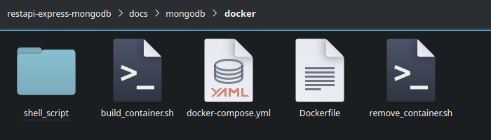

Basicamente usaremos apenas dois scripts.

1) O build_container.sh será responsável por construir o container e executar os demais scripts que restauram os backups e criam os usuários.
2) O remove_container.sh será responsável por destruir completamente o container e a imagem que ele gerou.

---

### Permissão de execução

Para executar os scripts será necessário darmos permissão de execução a eles, para isso basta executar o comando baixo dentro do diretório onde se encontram.

```bash
chmod +x build_container.sh && chmod +x remove_container.sh
```

---

### Criando o container

Para criar o container é muito simples, dentro do diretórios onde se encontram os scripts execute o seguinte comando:

```bash
./build_container.sh
```

Se tudo deu certo, no final da execução do script você verá algo como:

```bash
Script restore_backup_mongodb.sh finalizado
Aguardando se conectar na rede...
Criando os usuários de acesso ao banco
{ ok: 1 }
{ ok: 1 }
Script create_user_mongodb.sh finalizado
Tarefa finalizada. Verifique se o container foi criado com sucesso!
```

Você também pode ver se o container está em execução rodando o seguinte comando no terminal:

```bash
docker container ls
```
O retorno deste comando deve ser algo como:

```bash
IMAGE      COMMAND                  CREATED         STATUS              NAMES
mongo_db   "docker-entrypoint.s…"   1 minutes ago   Up 1 minutes        mongo_db
```

Veja que foi criando um container com o nome mongo_db. Além do MongoDB este container já trás 2 usuários configurados para acessarmos o banco de dados. O usuário ROOT(super administrador): "tglima" e o usuário padrão: "userdb". Além dos usuários toda estrutura básica do MongoDB, incluindo tabelas e registros já estão presentes.

Você pode [testar o seu MongoDB através do Compass](#testar-o-mongodb-com-o-compass).

---

### Destruindo o container
Para destruir o container é tão simples quanto criar. Para destruir o container execute o seguinte comando dentro do diretório onde se encontram os scripts:

```bash
./remove_container.sh
```

Se tudo deu certo, no final da execução do script você verá algo como:

```bash
[+] Running 2/0
 ⠿ Container mongo_db     Removed                                                                             0.0s
 ⠿ Image mongo_db:latest  Removed                                                                             0.0s
Tarefa de remoção de container finalizada
```
---

## Instalando o MongoDB na sua máquina

Para instalar o MongoDB localmente na sua máquina, você deve visitar o [site oficial](https://www.mongodb.com/download-center/community/releases) e baixar a versão comunity conforme seu sistema operacional.

Não vou detalhar aqui o processo de instalação, mas é importante que o usuário ROOT(super administrador) seja "tglima" e sua senha seja "mongoContainer".

---

## Utilizando o MongoDB direto da web

Caso você não queira instalar o MongoDB na sua máquina, existe a possibilidade de você criar uma conta gratuita no [site oficial do projeto](https://www.mongodb.com/cloud/atlas/register) e utilizar a base de dados direto da web.

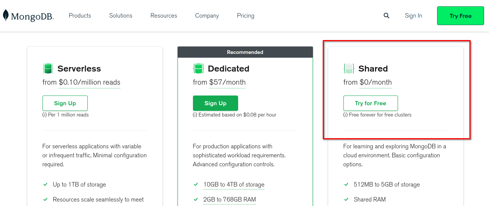

Não vou detalhar aqui o processo de criação de conta e nem como configurar, mas é importante que o usuário ROOT(super administrador) seja "tglima" e sua senha seja "mongoContainer".

---

## Testar o MongoDB com o Compass

O [Compass](https://www.mongodb.com/try/download/compass) é uma excelente ferramenta para gerenciar nossa base de dados no MongoDB. Para o nosso primeiro acesso vamos utilizar o usuário ROOT.

---

### Acessando o MongoDB criado pelo local ou do container

Caso você tenha instalado o seu MongoDB localmente ou através de um container, siga os passos abaixo:

Após abrir o "Compass", faça:

1) Clique em "New connection"
2) Depois na aba "Authentication", Por fim na aba "Username/Password"
3) No campo Username preencha com: tglima
4) No campo Password preencha com: mongoContainer

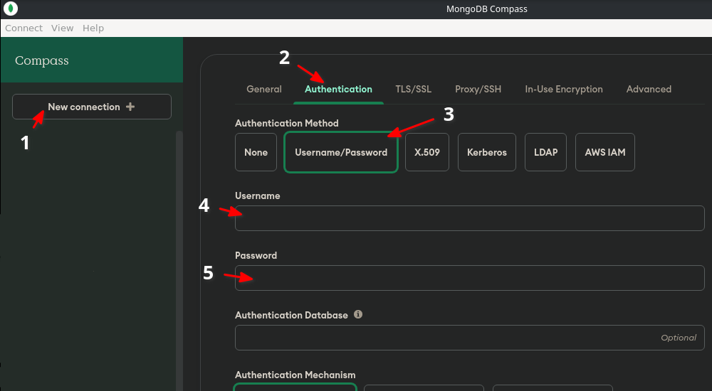

Após isso faça:

1) Clique em "Save e Connect".
2) Defina um nome para essa sua conexão, no meu exemplo estou criando como ROOT(Super Administrador)
3) Vou escolher uma cor de destaque para evitar de usar essa conexão no futuro
4) Por fim clique em "Save e Connect".

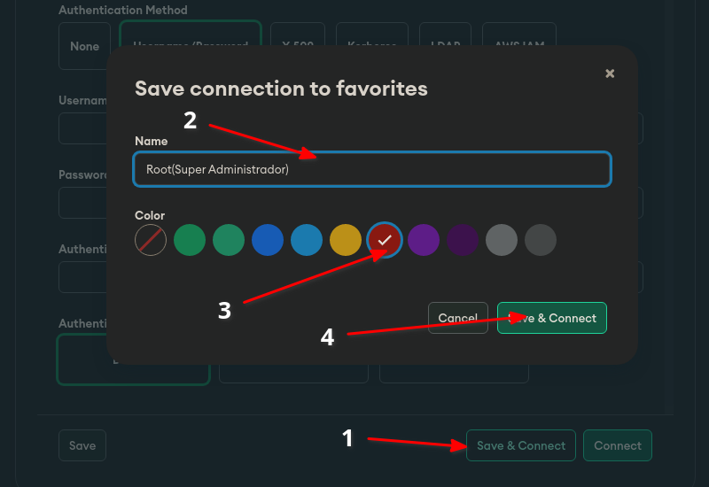

Se tudo deu certo você verá algo como a imagem abaixo:

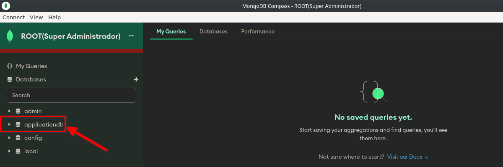

Se você instalou o seu MongoDB através do container, você verá o banco de dados "applicationdb". Sendo assim você pode pular para o item: [Navegando nas tabelas](#navegando-nas-tabelas)

Porém se você instalou o seu MongoDB de forma tradicional, teremos que restaurar os backups e criar os usuários manualmente.

---

### Acessando o MongoDB da Web

Para acessar o seu banco do MongoDB direto da web é simples. Nesta tela clique:

**1) No botão "Connect"**

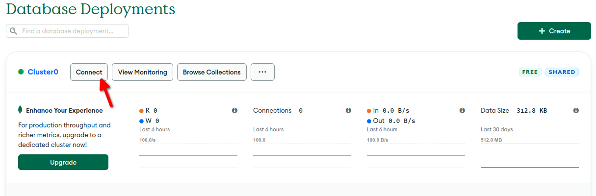

**2) Na opção MongoDB Compass**

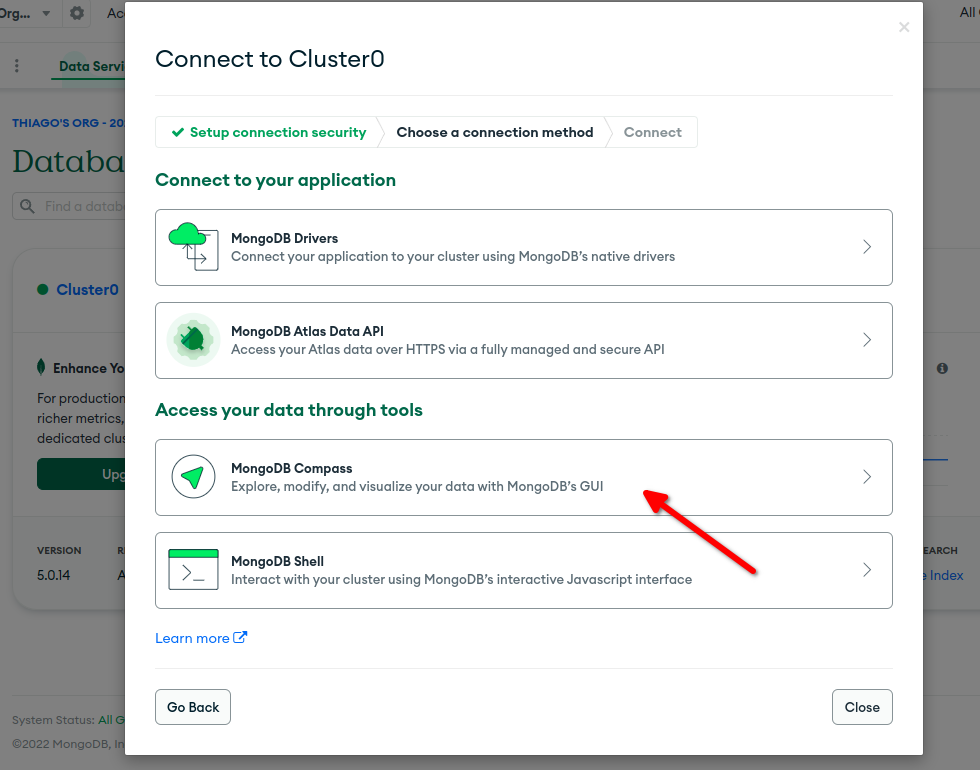

**3) Note que temos uma string de conexão. Vamos copiar essa string clicando no botão indicado.**

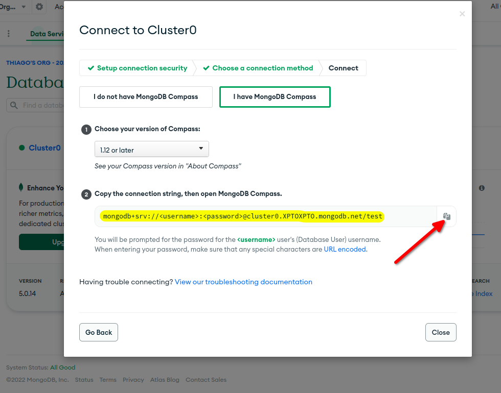

**4) Vamos abrir o Compass e siga os passos abaixo:**

 1) Clique em **"New connection"**
 2) No campo **URI** cole a string de conexão que você pegou no site
 3) Por fim clique em **"Authentication"**.

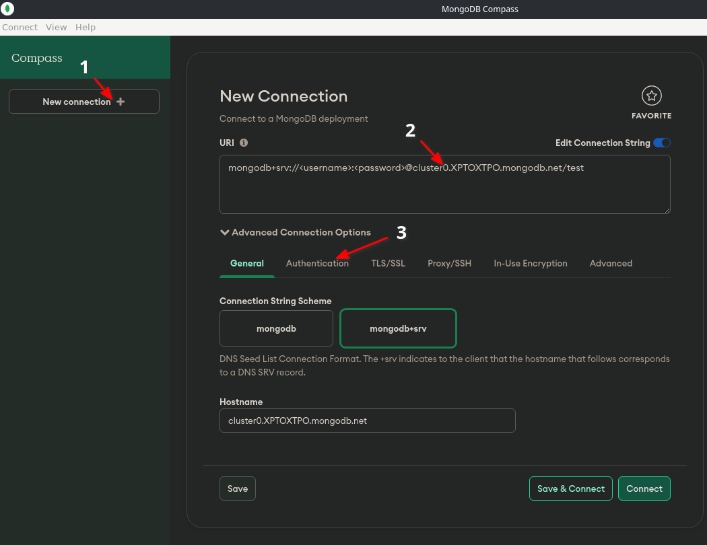

**5) Agora na aba Authentication, selecione a opção "Username/Password" e siga os passos abaixo:**

1) No campo Username preencha com: **tglima**
2) No campo Password preencha com: **mongoContainer**.
3) Por fim clique em **"Save e Connect"**.

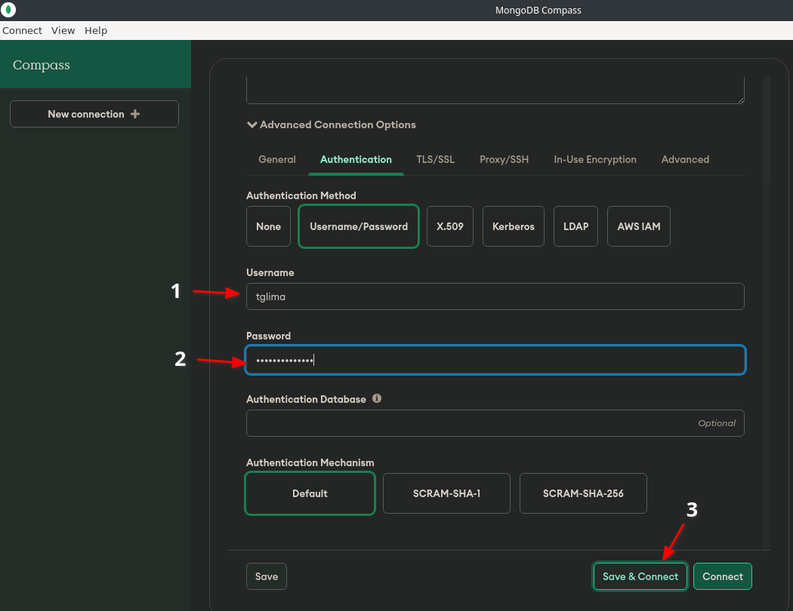

**6) Na tela que vai surgir siga os passos abaixo:**

1) Informe um nome para essa conexão.
2) Defina uma cor.
3) Por fim clique em **"Save e Connect"**.

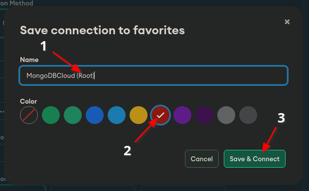

**7) Se tudo deu certo você verá algo muito parecido com a imagem abaixo:**

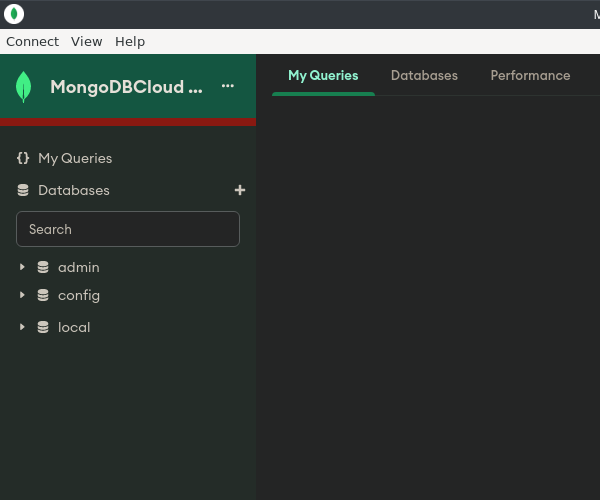

---

## Criando o usuário

Em construção

## Restaurar Backups

Em construção

## Navegando nas tabelas

Em construção