# Configurando o MongoDB

## Objetivo
Como já foi dito na [página inicial](../../README.md), este projeto utiliza o banco de dados não relacional MongoDB. Sendo assim precisamos configurar uma instância do MongoDB, está página serve como um guia básico de como restaurar os backups e criar o usuário específico da aplicação.

Basicamente existem três de formas de configurar o MongoDB para o nosso projeto.

 1) [Usando scripts e criando o container](#usando-scripts-e-criando-o-container)
 2) [Instalando o MongoDB na sua máquina](#instalando-o-mongodb-na-sua-máquina)
 3) [Utilizando o MongoDB direto da Web](#acessando-o-mongodb-da-web)

---

## Usando scripts e criando o container

Para seguir essas instruções você precisará ter o docker e o docker-compose instalados em sua máquina. As versões minímas que devem ser utilizadas também estão descritas na [página inicial](../../README.md) deste projeto.

**Os scritps que usaremos foram feitos para serem executados em ambiente Linux.** Os scripts que usaremos se encontram em: "pastaraizdoprojeto<b>/docs/mongodb/docker</b>".


Basicamente usaremos apenas dois scripts.

1) O build_container.sh será responsável por construir o container e executar os demais scripts que restauram os backups e criam os usuários.
2) O remove_container.sh será responsável por destruir completamente o container e a imagem que ele gerou.

---

### Permissão de execução

Para executar os scripts será necessário darmos permissão de execução a eles, para isso basta executar o comando abaixo dentro do diretório onde se encontram.

```bash
chmod +x build_container.sh && chmod +x remove_container.sh
```

---

### Criando o container

Para criar o container é muito simples, dentro do diretórios onde se encontram os scripts execute o seguinte comando:

```bash
./build_container.sh
```

Se tudo deu certo, no final da execução do script você verá algo como:

```bash
Script restore_backup_mongodb.sh finalizado
Aguardando se conectar na rede...
Criando os usuários de acesso ao banco
{ ok: 1 }
{ ok: 1 }
Script create_user_mongodb.sh finalizado
Tarefa finalizada. Verifique se o container foi criado com sucesso!
```

Você também pode ver se o container está em execução, rodando o seguinte comando no terminal:

```bash
docker container ls
```
O retorno deste comando deve ser algo como:

```bash
IMAGE      COMMAND                  CREATED         STATUS              NAMES
mongo_db   "docker-entrypoint.s…"   1 minutes ago   Up 1 minutes        mongo_db
```

Veja que foi criando um container com o nome mongo_db. Além do MongoDB este container já trás 2 usuários configurados para acessarmos o banco de dados. O usuário ROOT(super administrador): "tglima" e o usuário padrão: "userdb". Além dos usuários toda estrutura básica do MongoDB, incluindo tabelas e registros já estão presentes.

---

### Destruindo o container
Para destruir o container é tão simples quanto criar. Para destruir o container execute o seguinte comando dentro do diretório onde se encontram os scripts:

```bash
./remove_container.sh
```

Se tudo deu certo, no final da execução do script você verá algo como:

```bash
[+] Running 2/0
 ⠿ Container mongo_db     Removed                                                                             0.0s
 ⠿ Image mongo_db:latest  Removed                                                                             0.0s
Tarefa de remoção de container finalizada
```
---

## Instalando o MongoDB na sua máquina

Para instalar o MongoDB localmente na sua máquina, você deve visitar o [site oficial](https://www.mongodb.com/download-center/community/releases) e baixar a versão comunity conforme seu sistema operacional.

Não detalharei o processo de instalação, mas é importante que o usuário ROOT(super administrador) seja "tglima" e sua senha seja "mongoContainer".

---

## Utilizando o MongoDB direto da web

Caso você não queira instalar o MongoDB na sua máquina, existe a possibilidade de você criar uma conta gratuita no [site oficial do projeto](https://www.mongodb.com/cloud/atlas/register) e utilizar a base de dados direto da web.


Não detalharei o processo de criação de conta e nem como configurar, mas é importante que o usuário ROOT(super administrador) seja "tglima" e sua senha seja "mongoContainer".

---

## Testar o MongoDB com o Compass

O [Compass](https://www.mongodb.com/try/download/compass) é uma excelente ferramenta para gerenciar nossa base de dados no MongoDB. Para o nosso primeiro acesso, utilizaremos o usuário ROOT.

---

### Acessando o MongoDB instalado manualmente ou através do container

Caso você tenha instalado o seu MongoDB localmente ou através de um container, siga os passos abaixo:

Após abrir o "Compass", faça:

1) Clique em "New connection"
2) Depois na aba "Authentication", Por fim na aba "Username/Password"
3) No campo Username preencha com: tglima
4) No campo Password preencha com: mongoContainer


Após isso faça:

1) Clique em "Save e Connect".
2) Defina um nome para sua conexão, no meu exemplo estou criando como ROOT(Super Administrador)
3) Escolhi uma cor de destaque para evitar seu uso em uma conexão no futuro
4) Por fim clique em "Save e Connect".


Se tudo deu certo você verá algo como a imagem abaixo:


Se você instalou o seu MongoDB através do container, você encontrará o banco de dados "applicationdb". Sendo assim você pode pular para o item: [Navegando nas tabelas](#navegando-nas-tabelas)

Porém, se você instalou o seu MongoDB de "método tradicional", teremos que restaurar os backups e criar os usuários manualmente.

---

### Acessando o MongoDB da Web

Para acessar o seu banco do MongoDB direto da web é simples. Nesta tela clique:

**1) No botão "Connect"**


**2) Na opção MongoDB Compass**


**3) Note que temos uma string de conexão. Vamos copiar essa string clicando no botão indicado.**


**4) Vamos abrir o Compass e siga os passos abaixo:**

 1) Clique em **"New connection"**
 2) No campo **URI** cole a string de conexão que você pegou no site
 3) Por fim clique em **"Authentication"**.


**5) Agora na aba Authentication, selecione a opção "Username/Password" e siga os passos abaixo:**

1) No campo Username preencha com: **tglima**
2) No campo Password preencha com: **mongoContainer**.
3) Por fim clique em **"Save e Connect"**.


**6) Na tela que vai surgir siga os passos abaixo:**

1) Informe um nome para essa conexão.
2) Defina uma cor.
3) Por fim clique em **"Save e Connect"**.


**7) Se tudo deu certo você verá algo muito parecido com a imagem abaixo:**


---

## Criando o banco de dados e as collections

<br>

> <br>
>
> **Caso você tenha utilizado meu script que cria um container com o MongoDB você pode pular essa etapa**, visto que durante a criação do container todo o backup foi restaurado de forma automática.
>
> <br>

<br>

As collections no MongoDB correspondem as tabelas. No MongoDB não é possível criar um banco de dados sem tabelas, então quando criarmos nosso banco de dados, obrigatóriamente teremos que criar uma tabela, mesmo que ela não tenha nenhum registro ou estrutura definida.

Nossa aplicação utiliza um banco dados chamado: **applicationdb**. Para criar o banco de dados não tem muito segredo basta seguir os passos:

**1) Abra o Compass e se conecte ao seu banco de dados.**

**2) No lado superior esquerdo, clique no botão Create database.**

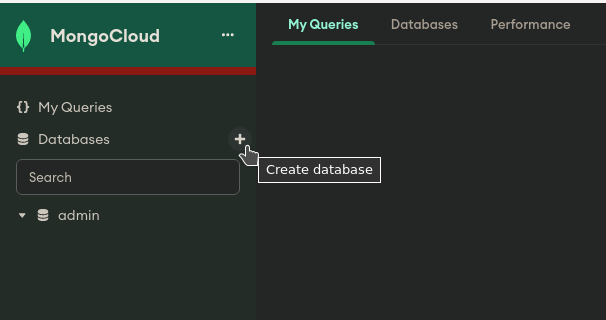

**3) Na tela que surgiu, informe os seguites valores:**

| Nome do campo | Texto a ser digitado |
| --- | --- |
| Database Name: | **applicationdb** |
| Collection Name:| **apiLogs** |

**4) Por fim, clique no botão Create Database**

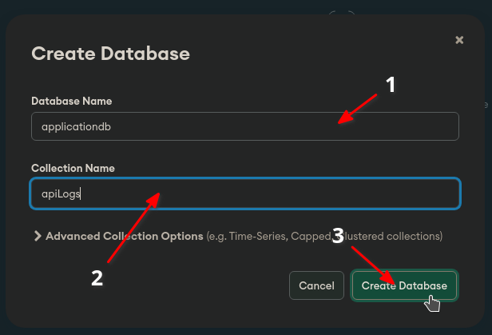

 <br>

Siga os passos abaixo para criar a collection("tabela") customers e depois repita o processo para criar todas as outras.

**1) Ao lado do nome do seu banco de dados, clique no botão Create collection**

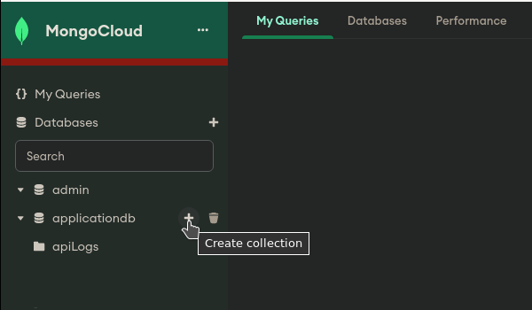

**2) Na janela que surgiu, no campo "Collection Name", informe o nome "customers" e em seguida clique em Create Collection**

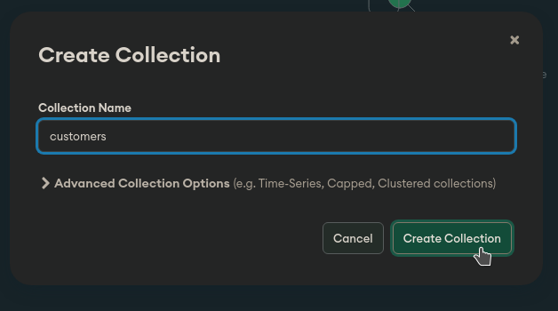

**3) Se tudo deu certo agora você deve visualizar 2 collections no seu banco de dados**

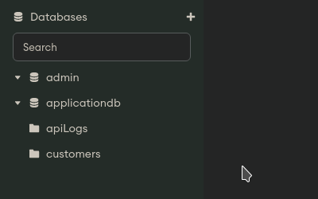

**4) Repita esses passos e crie todas as collections que estão listadas abaixo:**

- contactMessages
- orders
- products
- roles
- urlAccessControl
- users

**5) No final, seu banco de dados deve conter oito collections, como na figura abaixo:**

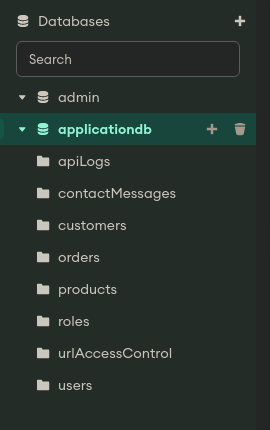

---

## Restaurar Backups

<br>

> <br>
>
> **Caso você tenha utilizado meu script que cria um container com o MongoDB você pode pular essa etapa,** visto que durante a criação do container todo o backup foi restaurado de forma automática.
>
> Para ficar mais simples a explicação, a partir de agora chamarei as collections do MongoDB de tabelas e os arquivos .JSON de collections. OK?
>
> <br>

<br>

No seguinte caminho: pastadoprojeto<b>/docs/mongodb/collections/</b> você encontrará todas as collections que usaremos para restaurar nossas tabelas no MongoDB.

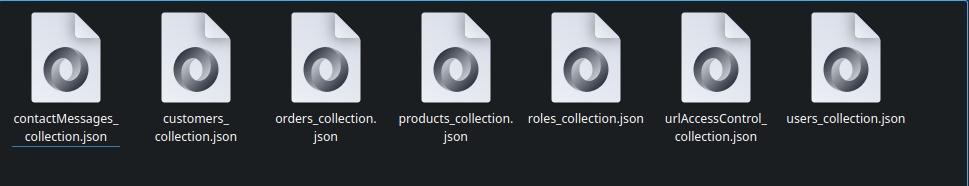

Não altere nenhum arquivo para evitar problemas futuros.

1) Selecione a tabela que você deseja restaurar. No meu caso eu escolhi a tabela **customers**

2) Clique no botão **Import Data**

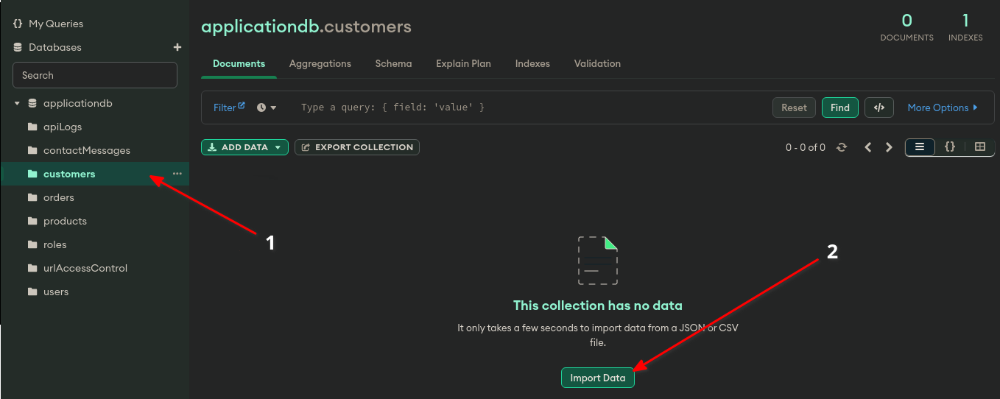

3) Na janela que surgiu, clique em **Select a file...**

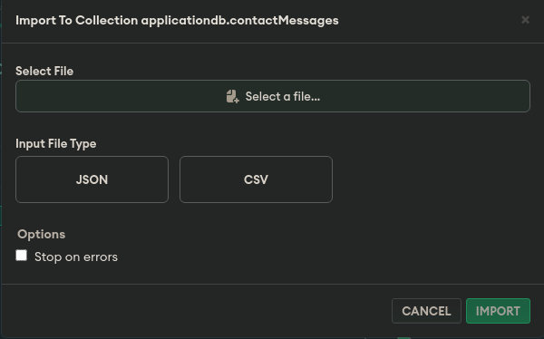

Você deve indicar onde se encontra o arquivo que você deseja restaurar, no meu caso ele se encontra no seguinte caminho: pastadoprojeto/docs/mongodb/collections/<b>customers_collection.json</b>. Note que selecionei o arquivo **customers_collection.json**, porque planejo restaurar a tabela **customers**


**4) Após indicar qual arquivo você deseja importar, siga os passos abaixo:**

- No campo **Input File Type** selecione a opção **JSON**
- Em **Options** marque a opção **Stop on errors**
- Por fim clique no botão **Import**

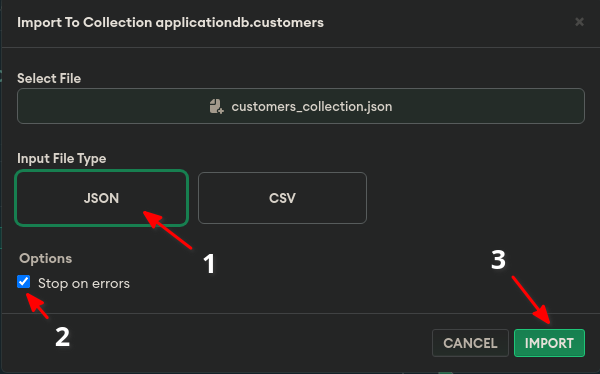

Se tudo deu certo, agora quando você clicar na tabela **customers** ela deve exibir algo muito parecido com a imagem abaixo:

**5) Agora você deve fazer o mesmo com todas as outras tabelas. Boa sorte!**

---

## Navegando nas tabelas

Existem basicamente 2 formas de navegar(realizar consultas) nas tabelas do MongoDB através do Compass.

Neste tutorial utilizarei o Mongosh, mas será coisa bem simples, para quem tem interesse em aprender mais sobre consultas no MongoDB, recomendo fortemente que assista essa [playslist](https://www.youtube.com/playlist?list=PLWkguCWKqN9OSqOOKvoQaUtQAszYhoBYE).

**1)** Abra o Compass e se conecte ao seu banco de dados.

**2)** Na parte inferior, existe uma pequena linha escura que lembra um terminal. **Clique na setinha** que se encontra no canto direito

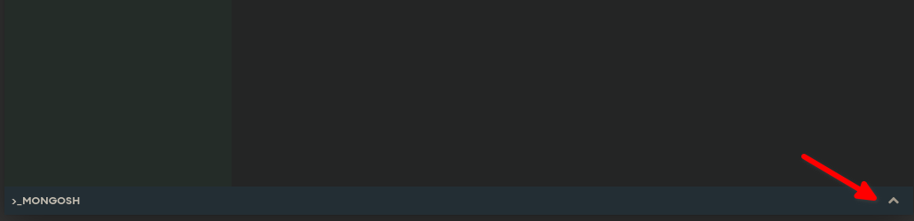

**3)** O terminal do mongosh será expandido e estará pronto para ser executado.

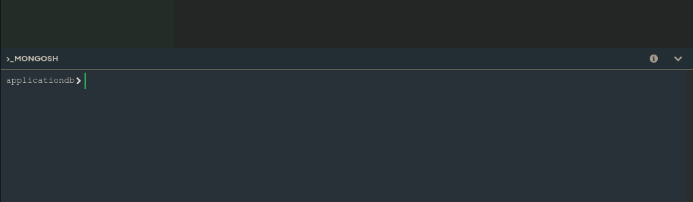

**4)** Para garantir que realizaremos a consulta no banco de dados correto, usaremos o comando abaixo:
<br>

```bash
use applicationdb

```
<br>

**5)** Exemplos de consultas no MongoDB


### Pesquisar registros com valor específico.

Vamos começar com algo simples, Pesquisar na tabela customers o registro onde 'nuDocument' seja igual a '43274629936';

<br>

```bash

db.getCollection("customers").find({'nuDocument': '43274629936'})

```
<br>

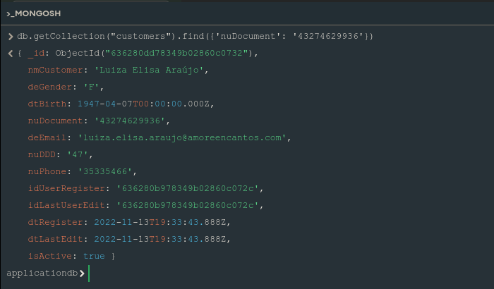


Neste exemplo ele retornou apenas um registro, isso porque só existe um registro na tabela customers com o nuDocument igual 43274629936.

### Pesquisar registros utilizando "like"

Agora, pesquisaremos todos os registros que contenham no nmCustomer o termo Martin.

<br>

```bash

db.getCollection("customers").find({'nmCustomer': {'$regex': /martin/i}})

```
<br>

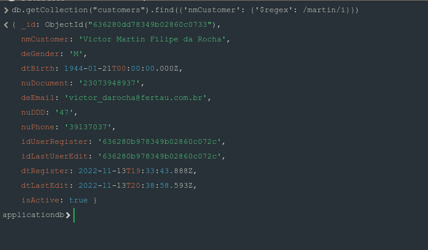

Note que ele retornou o registro do 'Victor Martin Filipe da Rocha' mesmo na pesquisa a palavra informada estava com todas as letras minusculas e o nome 'Martin' estar no meio da sentença. Isso porque ao utilizar o recurso de regex, ele permitiu que a pesquisa fosse feita por uma expressão regular. Já o parâmetro i indica que ele deve desconsiderar letras minusculas e maiúsculas.


### Pesquisar registros e exibir colunas específicas no resultado.

Agora pesquisaremos todos os registros que contenham o nuDDD igual a 47, porém quero seja exibido apenas o nmCustomer, nuDDD e nuPhone.

<br>

```bash

db.getCollection("customers").find({'nuDDD': '47'},{'nmCustomer': 1, 'nuDDD': 2, 'nuPhone':3})

```
<br>


Para retornar colunas específicas, logo após definirmos o filtro de pesquisa abrimos "{" e dentro descrevemos quais colunas e em qual ordem elas devem ser mostradas.

<br>

### Outros exemplos de pesquisas

```bash

#Contabiliza quantos registros temos na tabela "customers" sem filtro
db.getCollection("customers").find().count();

#Contabiliza quantos registros temos na tabela customers onde o deGender seja F ou f
db.getCollection("customers").find({'deGender': {'$regex': /f/i}}).count();

#Retorna todos os clientes onde a data dtBirth seja superior a 01/01/1960.
#No retorno só será exibido as colunas nmCustomer e dtBirth
db.getCollection("customers").find({'dtBirth': {'$gt': ISODate('1960-01-01')}},{'nmCustomer': 1, 'dtBirth': 2})

#Retorna todos os clientes onde a data dtBirth seja inferior a 01/01/1990.
# e o deGender seja m ou M
#No retorno só será exibido as colunas nmCustomer, dtBirth e deGender
db.getCollection("customers").find({'$and':[{'dtBirth': {'$lt': ISODate('1990-01-01')}}, {'deGender': {'$regex': /m/i}}]},{'nmCustomer': 1, 'dtBirth': 2, 'deGender': 3})

```
<br>

---

## Criando o usuário

> <br>
>
> **Este procedimento só é necessário se você está utilizando o MongoDB instalado localmente na sua máquina.**
>
> **Caso você tenha utilizado meu script que cria um container você pode pular essa etapa.**
>
> **Caso você esteja utilizando o MongoDB diretamente da Web https://cloud.mongodb.com, este tutorial não funcionará para você.**
>
> <br>

<br>

Para criar usuários no MongoDB não tem muito segredo, usaremos o mongosh para esta tarefa.

**1) Abra o Compass e se conecte ao seu banco de dados.**
**2) Na parte inferior, existe uma pequena linha escura que lembra um terminal. Clique na setinha no canto direito**


**3) O terminal do mongosh será expandido e estará pronto para ser executado.**


**4) Agora devemos executar 2 comandos.**

No primeiro indicamos para qual banco estamos direcionando a ação.

```bash
use admin
```

Neste segundo criamos o usuário "userdb", com a senha "userpass_mongodb" e definimos que ele terá permissão de leitura e escrita no banco de dados. "applicationdb".

```bash
db.createUser({ user: "userdb", pwd: "userpass_mongodb", roles: [ { role: "readWrite", db: "applicationdb" } ] })
```

Repetiremos o processo acima selecionando agora o banco de dados "applicationdb".

```bash
use applicationdb
db.createUser({ user: "userdb", pwd: "userpass_mongodb", roles: [ { role: "readWrite", db: "applicationdb" } ] })
```

Simples não é?

Os comandos acima estão presentes no seguinte caminho: "pastaraizdoprojeto<b>/docs/mongodb/commands/create_users.txt</b>".
